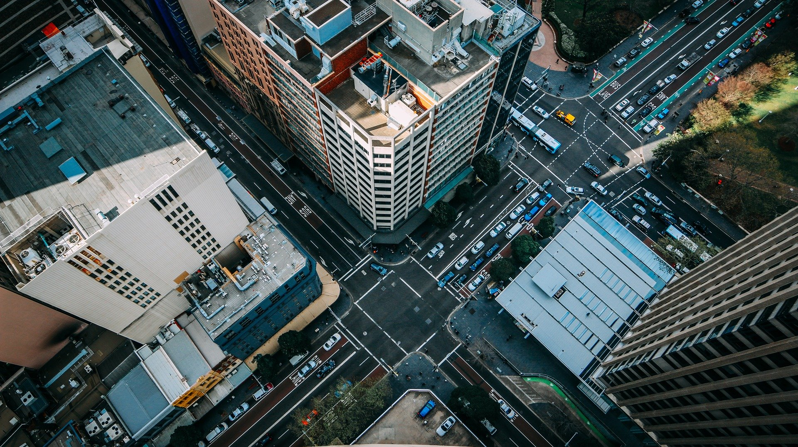

## 第5回ポストコロナ未来社会ワークショップ
# コロナ時代のモビリティ

## 開催情報
- **日時**： 10月30日（金）13:00-16:00
- **開催**：Zoomによるオンラインワークショップ
- **主催**：[計測自動制御学会 (SICE)](https://www.sice.jp)
- **企画**：[SICEポストコロナ未来社会WG](https://postcorona-sice.github.io/index_jp.html)
- **オーガナイザ**
  - 牛房 義明（北九州市立大学）
  - 永原 正章（北九州市立大学）

## 講演者（予定）
- **特別講演**
  - [貝原 俊也](https://kuid-rm-web.ofc.kobe-u.ac.jp/profile/ja.82abdf69905dda6c520e17560c007669.html)（神戸大学）
- **招待講演**
  - [伊藤 昌毅](http://www.niya.net/index-j.html)（東京大学）
  - [濱田 千夏](http://www.npo-ido.com/)（NPO法人I-DO）
  - [滑川 徹](https://www.st.keio.ac.jp/tprofile/sd/namerikawa.html)（慶應義塾大学）
  - [牛房 義明](https://smart-life.ai/member/ushifusa)（北九州市立大学）

## 講演プログラム
- 13:00-13:10 **オープニング** <!--SICE会長 小野晃（産総研）-->
- 13:10-13:40 **（特別講演）** 貝原 俊也（神戸大学）
- 13:40-14:00 **(講演)** 伊藤 昌毅（東京大学）
- **休憩**（10分）
- 14:10-14:30 **(講演)** 植木 和宏（NPO法人I-DO）
- 14:30-14:50 **(講演)** 滑川 徹（慶應義塾大学）
- 14:50-15:10 **(講演)** 牛房 義明（北九州市立大学）
- **休憩**（10分）
- 15:10-15:50 **パネルディスカッション**
- 15:50-16:00 **クロージング**
